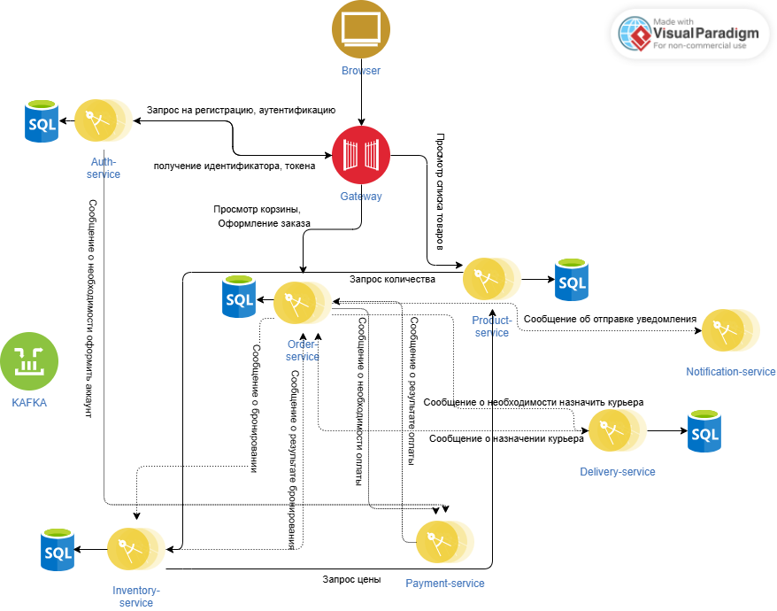
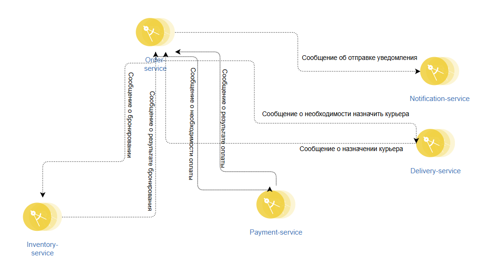

## ПРОЕКТНАЯ РАБОТА
### Собрать проект
`mvn package`
### Собрать и запушить docker образы приложений
```
docker image build --platform linux/amd64 -t alexadubinina87/auth-gateway:12 ./ms/auth-gateway/auth-gateway
docker push alexadubinina87/auth-gateway:13

docker image build --platform linux/amd64 -t alexadubinina87/auth-service:12 ./ms/auth-service/auth-service
docker push alexadubinina87/auth-service:12

docker image build --platform linux/amd64 -t alexadubinina87/inventory-service:12 ./ms/inventory-service/inventory-service
docker push alexadubinina87/inventory-service:12

docker image build --platform linux/amd64 -t alexadubinina87/product-service:12 ./ms/product-service/product-service
docker push alexadubinina87/product-service:12

docker image build --platform linux/amd64 -t alexadubinina87/notification-service:12 ./ms/notification-service/notification-service
docker push alexadubinina87/notification-service:12

docker image build --platform linux/amd64 -t alexadubinina87/order-service:12 ./ms/order-service/order-service
docker push alexadubinina87/order-service:12

docker image build --platform linux/amd64 -t alexadubinina87/payment-service:12 ./ms/payment-service/payment-service
docker push alexadubinina87/payment-service:12
```

# Описание проекта 

### Реализованы следующие пользовательские сценарии

Есть клиент  
И есть интернет-магазин  
И клиент переходит на страницу Товары
Тогда появляется список товаров

Когда клиент нажимает карточку на товар в списке результатов поиска  
Тогда клиент переходит на карточку с описанием товара

Когда клиент нажимает на кнопку "Добавить в корзину"  
Тогда товар добавляется в корзину

Когда клиент переходит в корзину  
Тогда он видит список всех добавленных им в корзину товаров

Когда клиент нажимает на кнопку "Удалить из корзины"  
Тогда товар удаляется из корзины

Когда клиент нажимает на кнопку "Пополнить баланс"   
Тогда возникает форма ввода суммы пополнения баланса

Когда клиент нажимает на кнопку "Пополнить"   
Тогда баланс клиента пополняется на указанную им сумму

Когда клиент нажимает на кнопку "Оформить заказ"   
Тогда происходит списание денег с баланса и заказ передается в обработку

Когда оплата заказа прошла успешно   
Тогда статус заказа переходит в состояние "Оплачен"
И клиенту приходит уведомление с информацией о заказе и успешной оплате  
И заказ резервируется на складе  
И создаётся заявка для службы доставки


### Системные действия:
- клиент может просматривать список товаров
- клиент может получить информацию о товаре
- клиент может положить товар в корзину
- клиент может удалить товар из корзины
- клиент может оформить заказ
- клиент может пополнить баланс
- клиент может просмотреть баланс
- клиент может оплатить заказ
- приложение отправляет клиенту уведомление с информацией о сделанном заказе
- приложение отправляет клиенту уведомление об успешной/неуспешной оплате
- приложение резервирует товар на складе после оформления заказа
- приложение передаёт заказ в службу доставки


### Модель на основе ООП

Основные сущности:
- Клиент (User)
- Товар (Product)
- Корзина (Card)
- Заказ (Order)
- Аккаунт (Account)
- Склад (Inventory)
- Оплата (Payment)


Сервисы:
- AuthService
- ProductService (поиск товара и просмотр информации о нём)
- OrderService (добавление/удаление товаров в корзине и оформление заказа)
- NotificationService (отправка уведомлений)
- InventoryService (передача информации о заказе на склад)
- PaymentService (оплата заказа)
- DeliveryService (передача заказа в службу доставки) //todo

### Системные действия в виде API

**auth-service**
- создание клиента: POST /api/v1/register {RegRequest dto}
- получение клиента по id: GET /api/v1/user/{id}

**product_service**
- просмотр списка товаров: GET /api/v1/product
- получение информации о товаре по id: GET /api/v1/product/{id}

**order-service**
- получение корзины по id: GET /api/v1/order/cart {shopUser}
- добавление продукта в корзину: POST /api/v1/order/cart/add {AddItemRequestDto dto}


- получение статуса заказа по id: GET /api/v1/order/status/{id}
- создание заказа: POST /api/v1/order/cart/submit { shopUser }
- изменение заказа: PUT /api/v1/order/status/{id} { shopUser, orderId, status }
- отмена заказа: DELETE /api/v1/order/{id}


**payment-service**
- пополнение баланса: POST /api/v1/account/fill-up {shopUser, fillUpRequestDto}

**inventory-service**
- передача данных о заказе на склад: POST /api/v1/reserve {oder}

**delivery-service**
- передача заказа в сервис доставки: POST /api/v1/delivery {order}

**notification-service**
- отправка письма: POST /api/internal/notification {emailRequestDto}


### Описание сервисов

----------------------

**Название**: auth-service  
**Описание**: Сервис для хранения информации о клиенте, регистрации клиента, аутентификации и авторизации клиента,
генерации, валидации токена.
При регистрации киента отправляет сообщение в Kafka для создания аккаунта клиента
**Запросы**:
- получение клиента по id: GET /api/v1/user/{id}
- аутентификация клиента : POST auth/login {authRequestDto :{login, password}}

**Команды**:
- создание клиента: POST /api/v1/register {regRequestDto}

**События**:
- событие о необходимости создать аккаунт пользователя: EVENT {CREATE_ACCOUNT, accountModel}

**Зависимости**: 

**Вопросы**: -

----------------------

**Название**: product-service  
**Описание**: Сервис для поиска товаров и хранения информации о них.

**Запросы**:
- просмотр списка товаров: GET /api/v1/product
- получение информации о товаре по id: GET /api/v1/product/{id}

**Команды**:
- добавить продукт: POST /api/v1/product {productDto}
- изменить продукт: PUT /api/v1/product {productDto}
- удалить продукт:DELETE /api/v1/product/{id}

**Вопросы**:

----------------------
**Название**: order-service  
**Описание**: Сервис для работы с корзиной и оформлением заказа.
После оформления заказа отправляет в Kafka сообщение о необходимости произвести списание денег с аккаунта и резервирование товара на складе
**Запросы**:
- получение корзины по id: GET /api/v1/order/cart {shopUser}
- получение статуса заказа по id: GET /api/v1/order/status/{id}

**Команды**:
- добавление продукта в корзину: POST /api/v1/order/cart/add {AddItemRequestDto dto}
- создание заказа: POST /api/v1/order/cart/submit { shopUser }
- изменение заказа: PUT /api/v1/order/status/{id} { shopUser, orderId, status }
- отмена заказа: DELETE /api/v1/order/{id}

**События**:
- событие о необходимости зарезервивовать товар на складе: EVENT {ORDER_RESERVE_PRODUCTS, reserveModel}
- событие о необходимости списать деньги с аккаунта: EVENT {ORDER_PAYMENT_PROCESS, paymentModel}
- событие о необходимости отправить уведомление клиенту о том, что статус заказа изменился: EVENT {NOTIFICATION_SEND, notificationModel}


**Зависимости**:
- получение цены товара от product-service
- получение актуального количетсва товара на складе notification-service
- событие от payment-service об оплате заказа: EVENT {PAYMENT_CONFIRMATION, paymentConfirmModel}
- событие от inventiry-service об успешном резервировании товара: EVENT {ORDER_RESERVE_CONFIRMATON, reserveConfirmationModel}

----------------------
**Название**: payment-service  
**Описание**: Сервис оплаты. Отправляет событие об статусе оплаты для заказа.  
**Запросы**:  
**Команды**:
- пополнение баланса: POST /api/v1/account/fiil-up {shopUser, fillUpRequestDto}

**События**:
- отправляет событие об успешной или нейспешной оплате заказа: EVENT {ORDER_CONFIRMATION_TOPIC, model}

**Зависимости**:
- событие от order-service о необходимости списать деньги со счета при оформлении заказа: EVENT {ORDER_PAYMENT_PROCESS, paymentModel}
- получение от auth-service события о необходимости создать аккаунт клиента при его регистрации: EVENT {CREATE_ACCOUNT, accountModel}

**Вопросы**:

----------------------
**Название**: inventory-service  
**Описание**: Сервис склада. Хранит информацию о товарах и их количестве.

**Запросы**: -  
**Команды**:
- передача данных о заказе на склад: POST /api/v1/reserve {oder}

**События**:
- событие о успешном резерве товаров на складе : EVENT {ORDER_RESERVE_CONFIRMATON, reserveConfirmationModel}


**Зависимости**: -  
**Вопросы**: -
----------------------

**Название**: delivery-service  
**Описание**: Сервис доставки заказов клиентам.  
**Запросы**: -  
**Команды**:
- передача заказа в сервис доставки: POST /api/v1/delivery {order}

**События**: -  
**Зависимости**: -  
**Вопросы**: -
----------------------

**Название**:  notification-service  
**Описание**: Сервис отправки уведомлений клиентам.  
**Запросы**: -  
**Команды**: -  
**События**: -  
**Зависимости**:
- событие от order-service для отправки уведомления клиенту о заказе: EVENT {NOTIFICATION_SEND, notificationModel}
- событие для payment-service отправки уведомления клиенту об оплате: EVENT {NOTIFICATION_SEND, notificationModel}


**Вопросы**: -


### Схема взаимодействия сервисов



### Реализация

Приложение состоит из 6 микросервисов и сервиса Api-Gateway.

Реализована jwt-token authorization.

Схема:


Архитектура спроектирована с использованием паттерна Сага, основанной на оркестровке (роль оркестровщика выполняет order-service).  

_Для справки:  
Сага представляет собой набор локальных транзакций. Каждая локальная транзакция обновляет базу данных и публикует сообщение или событие, инициируя следующую локальную транзакцию в саге.  
Если транзакция завершилась неудачей, например, из-за нарушения бизнес правил, тогда сага запускает компенсирующие транзакции, которые откатывают изменения, сделанные предшествующими локальными транзакциями.  
Оркестровка (Orchestration) — оркестратор говорит участникам, какие транзакции должны быть запущены._




